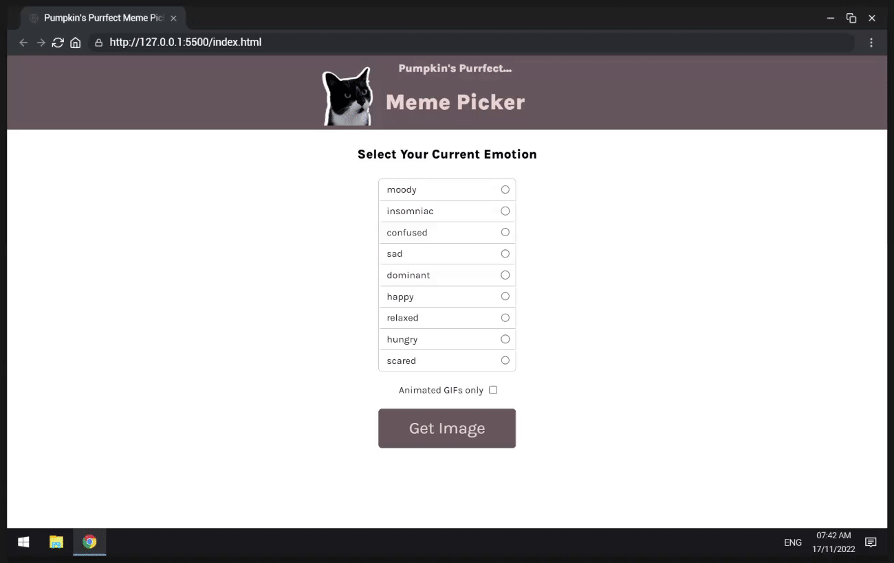

# Scrimba - Module 5: Essential JavaScript Concepts - Pumpkin's Purrfect Meme Picker

This is a follow-along solution to [Scrimba - Module 5: Essential JavaScript Concepts - Pumpkin's Purrfect Meme Picker](https://scrimba.com/playlist/pnXvVsP) practice project.

## About Scrimba

At Scrimba our goal is to create the best possible coding school at the cost of a gym membership! 💜
If we succeed with this, it will give anyone who wants to become a software developer a realistic shot at succeeding, regardless of where they live and the size of their wallets 🎉
The Frontend Developer Career Path aims to teach you everything you need to become a Junior Developer, or you could take a deep-dive with one of our advanced courses 🚀

- [Our courses](https://scrimba.com/allcourses)
- [The Frontend Career Path](https://scrimba.com/learn/frontend)
- [Become a Scrimba Pro member](https://scrimba.com/pricing)

Happy Coding!

## Table of contents

- [Scrimba - Module 5: Essential JavaScript Concepts - Pumpkin's Purrfect Meme Picker](#scrimba---module-5-essential-javascript-concepts---pumpkins-purrfect-meme-picker)
  - [About Scrimba](#about-scrimba)
  - [Table of contents](#table-of-contents)
  - [Overview](#overview)
    - [Learning objectives](#learning-objectives)
    - [Screenshot](#screenshot)
    - [Links](#links)
  - [My process](#my-process)
    - [Built with](#built-with)
    - [What I learned](#what-i-learned)
    - [Continued development](#continued-development)
  - [Author](#author)

## Overview

### Learning objectives

What will be learned while following along with this practice project:
- for of
- radio & checkbox inputs
- getElementsByClassName
- querySelector
- classList.remove
- import/export
- .includes()
- .filter()

### Screenshot

### Links

- Solution URL: [Github Repo](https://github.com/varonalearns/Meme-Picker)
- Live Site URL: [Netlify Live Site](https://classy-kataifi-c0fa06.netlify.app)

## My process

### Built with

- CSS custom properties
- Flexbox
- Vanilla JavaScript

### What I learned

As stated learning objectives, I learned about:
- for of
- import/export
- radio & checkbox inputs
- querySelector
- getElementsByClassName
- classList.remove
- .includes()
- .filter()

### Continued development

In the future, I definitely want to add more features to this project. I have a couple of ideas. Perhaps make a project based on dogs? It is something that I am contemplating, especially if I want to build my skills as a developer.

## Author

- Website - [Evalia Varona](https://www.evaliavarona.com)
- Hashnode - [@evavarona](https://evaliavarona.hashnode.dev)
